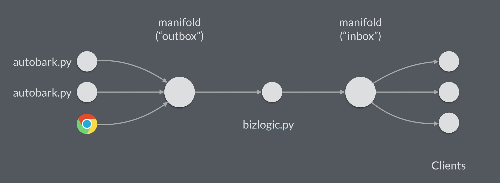

Barker
######

Barker is a set of microservices that mimics sending a tweet ("bark")
to a set of followers. Barker is intended to illustrate how to design
and connect a set of microservices using Datawire.

Barker Quickstart
=================

Barker includes a launch script that will start all the Barker
microservices::

  cd barker
  python launch.py

In addition to some diagnostic output, you'll see a stream of barks
continuously scroll by; these are randomly generated by the
``autobark.py`` client. The launch script includes a call to the
``listen.py`` client displaying barks directed to the user ``ark3``. You
can send barks using the ``bark.py`` client in another terminal::

  cd barker
  python bark.py ark3 This is my first manual bark.

Visit ``barker/webui/index.html`` in your browser to see the Barker UI.
A ``file://`` URL will work in most cases; see :ref:`websockets-notes`
for more information. You will see the same stream of barks for user
``ark3``, but with the newest barks on top. You can type a bark into the
UI and you'll see it appear in the stream of barks.

Barker also includes a basic monitoring setup. You can start the
monitoring with the monitoring launch script::

  cd monitoring
  python launch.py

Visit ``monitoring/index.html`` in your browser and you'll see two
real time graphs giving visibility into the state of the system.

.. note:: Killing a launch script (Ctrl-C) will kill all the
          microservices launched by that script.

Architecture
============

The architectural design of Barker is representative of many typical
processing problems. There is some large amount of input that needs to
be processed, one or more pieces of core business logic that implement
the desired processing, and some large amount of output that needs to be
collected and distributed. The overall structure of Barker's
architecture resembles the `LMAX architecture
<http://martinfowler.com/articles/lmax.html>`_.

The nature of the microservices comprising Barker was influenced by this
`article about Twitter scalability
<http://highscalability.com/blog/2013/7/8/the-architecture-twitter-uses-to-deal-with-150m-active-users.html>`_.
Twitter refers to new messages entering the system as residing in the
users' outboxes; messages awaiting retrieval for consumption reside in
users' inboxes. With the inbox/outbox manifolds keeping track of all the
messages in play, the clients that submit and retrieve messages can be
simple and stateless, like the Barker Web UI. The business logic in the
middle only has to determine which inboxes each message needs to reach.

One can imagine additional business logic sitting between the outboxes
and inboxes, functioning much the same way. A user followers service
could pay attention to *follow* and *unfollow* messages from the
clients, using them to keep track of who follows whom. A follow
suggestions service could use the followers graph to suggest additional
users to follow, passing said suggestions to the inboxes as messages.

Barker Slow Start
=================

Now that you have a grasp of the Barker architecture, let's go through
Barker in more detail. The launch script starts a number of different
microservices locally, each operating on a different host port. The main
services are the following:

* directory, which provides service location functionality
* a manifold that functions as the user inboxes
* an instance of business logic
* three manifold instances that function as the user outboxes
* five autobark instances that simulate multiple tweeters

We've instantiated different numbers of microservices to demonstrate
several different routing algorithms. For the outbox and inbox
manifolds, we use a consistent hashing algorithm that distributes
connections between different instances based on the username. In the
bizlogic, we use an ordered algorithm that implements automatic
failover.

To demonstrate automatic failover, copy the ``launch.py`` script
to ``launch-no-bizlogic.py`` and comment out the bizlogic command.
Then, run the following commands::

  python launch-no-bizlogic.py &
  python bizlogic.py --port 5680 &
  python bizlogic.py --port 5681 &

Then, start the monitoring::

  cd monitoring
  python launch.py &

Load the monitoring UI in your browser. Barks will be routed through
the bizlogic on 5680. If you kill the first bizlogic process, barks
will be routed to the second bizlogic on 5681. You'll see a small,
temporary increase in queue depth when you kill the first bizlogic
process as the failover occurs. If you kill the second bizlogic,
you'll see the queue depth will increase indefinitely. Starting a new
instance of the bizlogic will start queue processing again.

.. _websockets-notes:

Browser-based UI Notes
======================

Pointing the browser directly at the local filesystem is generally the
easiest way to access the Barker UI and Monitoring Dashboard web pages.
Simply use your browser's "Open File..." menu and navigate to the
``index.html`` file in the appropriate directory. Or you can type in the
URL directly: ``file://`` followed by the absolute path to the
``index.html`` file.

Barker relies on the ``proton.js`` library to speak AMQP over WebSockets
and a Node.js tool that proxies between WebSockets and TCP. This allows
the Barker UI and the Monitoring Dashboard to communicate with the
Python code without having to use an intervening web server and dealing
with the request-response nature of HTTP. Note that the ``proton.js``
library should be considered experimental, as the Datawire-style
reactive API is not yet implemented in ``proton.js``.

WebSockets are not restricted by an origin policy; browser Javascript
loaded from one host may connect to a different host. As a result, the
Barker and Monitoring launch scripts can pass the specified hostname to
the JS code on the filesystem, allowing the web page to talk to the rest
of the system directly as a first-class peer regardless of where the
browser is running. Furthermore, unlike a typical XMLHTTPRequest-based
implementation, no web server is required. The page's JS is able to
connect to the network even if the browser accesses the web page using a
``file://`` URL as described above.

Use of a web browser and the WebSocket Proxy can add an unexpected
complication: DNS resolution sometimes works differently across the
different pieces (the Python/Datawire code, the browser, and the proxy).
In particular, we have noticed that the hostname ``localhost`` can
resolve to two different addresses on machines with IPV6 enabled (i.e.
most modern systems). To avoid this problem, the default hostname for
Barker and the Monitoring Dashboard is ``127.0.0.1``. Please keep this
issue in mind if you pass a hostname to the launchers.
